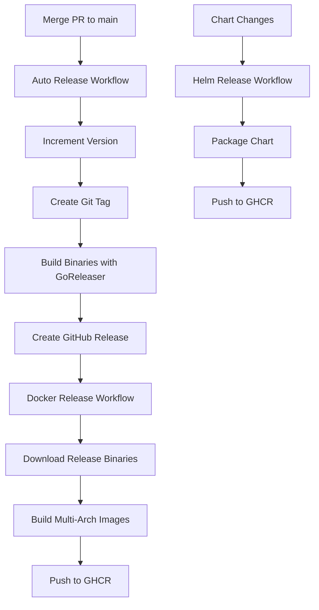

# Deployment Guide

This document explains how to deploy inboxfewer using Docker containers and Helm charts, including the automated build and release processes.

## Table of Contents

- [Container Images](#container-images)
- [Image Build Process](#image-build-process)
- [Helm Charts](#helm-charts)
- [Deployment Scenarios](#deployment-scenarios)
- [Release Process](#release-process)
- [Configuration](#configuration)

## Container Images

inboxfewer provides multi-architecture container images published to GitHub Container Registry (GHCR).

### Image Registry

```
ghcr.io/teemow/inboxfewer
```

### Supported Architectures

- **linux/amd64** - x86_64 systems
- **linux/arm64** - ARM64 systems (Apple Silicon, AWS Graviton, etc.)

### Image Tags

| Tag Pattern | Description | Use Case |
|------------|-------------|----------|
| `latest` | Latest stable release from `main` | Production |
| `v1.2.3` | Specific semantic version | Production (pinned) |
| `v1.2` | Major.minor version | Production (auto-update patch) |
| `v1` | Major version | Production (auto-update minor) |
| `sha-abc123` | Git commit SHA | Testing specific commits |
| `pr-42` | Pull request number | PR testing |
| `feature-xyz` | Feature branch name | Development/testing |

### Pulling Images

```bash
# Latest stable release
docker pull ghcr.io/teemow/inboxfewer:latest

# Specific version
docker pull ghcr.io/teemow/inboxfewer:v1.2.3

# Feature branch for testing
docker pull ghcr.io/teemow/inboxfewer:feature-issue-123
```

## Image Build Process

inboxfewer uses two different Docker build strategies depending on the context.

### Release Images (Production)

**Workflow:** `.github/workflows/docker-release.yml`

**Trigger:** After successful completion of Auto Release workflow

**Process:**
1. Auto Release workflow creates a new Git tag and GitHub release
2. GoReleaser builds binaries for all platforms (amd64, arm64)
3. Docker Release workflow is triggered automatically
4. Downloads pre-built binaries from the GitHub release
5. Builds multi-arch Docker images using `Dockerfile.release`
6. Pushes images with multiple tags (version, latest, etc.)

**Characteristics:**
- ✅ Multi-architecture (amd64, arm64)
- ✅ Uses optimized, pre-built binaries from GoReleaser
- ✅ Smaller build time (no compilation)
- ✅ Consistent with released binaries
- ✅ Tagged with semantic versions

**Dockerfile:** `Dockerfile.release`

```dockerfile
# Uses pre-built binaries (downloaded by workflow)
FROM alpine:latest
COPY binaries/inboxfewer_linux_${TARGETARCH} /app/inboxfewer
```

### Feature Branch Images (Testing)

**Workflow:** `.github/workflows/docker-build.yml`

**Trigger:** Push to feature branches or pull requests

**Process:**
1. Triggered on PR creation or push to non-main branches
2. Builds directly from source code using `Dockerfile`
3. Compiles Go binary during Docker build
4. Pushes image with branch/PR-specific tags

**Characteristics:**
- ✅ Single architecture (amd64 only) for faster builds
- ✅ Built from source code
- ✅ Ideal for integration testing
- ✅ Tagged with branch name or PR number
- ⚡ Faster CI feedback (parallel to tests)

**Dockerfile:** `Dockerfile`

```dockerfile
# Multi-stage build from source
FROM golang:1.25.3-alpine AS builder
RUN go build -o inboxfewer .
FROM alpine:latest
COPY --from=builder /build/inboxfewer .
```

## Helm Charts

Helm charts are published to OCI registry alongside container images.

### Chart Registry

```
oci://ghcr.io/teemow/charts/inboxfewer
```

### Chart Versioning

The chart follows **independent versioning** from the application:

- **Chart Version**: Only incremented when chart templates/configuration change (e.g., `0.1.0` → `0.1.1`)
- **App Version**: **Automatically updated** during each release to match the application version
- **Image Tag**: Defaults to `appVersion` (a specific version, never `latest`)

**How it works:**
1. When a new application release is created (e.g., `v1.2.3`)
2. The auto-release workflow updates `appVersion` in Chart.yaml to `1.2.3`
3. This change is committed before creating the git tag
4. Users installing the chart get this specific version by default (reproducible deployments)

**Example:**
- Chart version `0.1.1` with `appVersion: 1.2.3` → users get image `v1.2.3` by default
- After next release: `appVersion: 1.2.4` → users get image `v1.2.4` by default
- Chart version only bumps to `0.1.2` when templates themselves change

This approach:
- ✅ Follows Helm best practices (independent versioning)
- ✅ Avoids `latest` tag (reproducible deployments)
- ✅ No manual updates needed (fully automated)
- ✅ Users can still override with `--set image.tag=v1.2.2`

Charts are automatically published when changes are detected in `charts/**`.

### Installing the Chart

```bash
# Add authentication (if needed)
echo $GITHUB_TOKEN | helm registry login ghcr.io -u USERNAME --password-stdin

# Install latest version
helm install inboxfewer oci://ghcr.io/teemow/charts/inboxfewer

# Install specific version
helm install inboxfewer oci://ghcr.io/teemow/charts/inboxfewer --version 0.1.0

# Install with custom values
helm install inboxfewer oci://ghcr.io/teemow/charts/inboxfewer \
  --values my-values.yaml
```

### Chart from Feature Branch

For testing feature branches:

```bash
# Feature branch charts include branch name in version
helm install inboxfewer-test \
  oci://ghcr.io/teemow/charts/inboxfewer \
  --version 0.1.0-feature-xyz-abc123
```

### Chart Configuration

See `charts/inboxfewer/values.yaml` for all configuration options:

```yaml
image:
  repository: ghcr.io/teemow/inboxfewer
  tag: "latest"  # Override with specific version
  pullPolicy: IfNotPresent

replicaCount: 1

service:
  type: ClusterIP
  port: 8080

resources:
  limits:
    cpu: 500m
    memory: 512Mi
  requests:
    cpu: 100m
    memory: 128Mi

# Google OAuth configuration
googleAuth:
  enabled: true
  clientId: "your-client-id"
  clientSecret: "your-client-secret"

# GitHub token
githubToken:
  enabled: true
  token: "your-github-token"
```

## Deployment Scenarios

### Scenario 1: Production Deployment

Deploy the latest stable release:

```bash
# Using Helm
helm install inboxfewer oci://ghcr.io/teemow/charts/inboxfewer \
  --set image.tag=v1.2.3 \
  --set googleAuth.clientId=$GOOGLE_CLIENT_ID \
  --set googleAuth.clientSecret=$GOOGLE_CLIENT_SECRET \
  --set githubToken.token=$GITHUB_TOKEN

# Using kubectl directly
kubectl create secret generic inboxfewer-secrets \
  --from-literal=google-client-id=$GOOGLE_CLIENT_ID \
  --from-literal=google-client-secret=$GOOGLE_CLIENT_SECRET \
  --from-literal=github-token=$GITHUB_TOKEN

kubectl apply -f - <<EOF
apiVersion: apps/v1
kind: Deployment
metadata:
  name: inboxfewer
spec:
  replicas: 1
  selector:
    matchLabels:
      app: inboxfewer
  template:
    metadata:
      labels:
        app: inboxfewer
    spec:
      containers:
      - name: inboxfewer
        image: ghcr.io/teemow/inboxfewer:v1.2.3
        args:
        - serve
        - --transport
        - streamable-http
        - --http-addr
        - :8080
        ports:
        - containerPort: 8080
        env:
        - name: GOOGLE_CLIENT_ID
          valueFrom:
            secretKeyRef:
              name: inboxfewer-secrets
              key: google-client-id
        - name: GOOGLE_CLIENT_SECRET
          valueFrom:
            secretKeyRef:
              name: inboxfewer-secrets
              key: google-client-secret
        - name: GITHUB_TOKEN
          valueFrom:
            secretKeyRef:
              name: inboxfewer-secrets
              key: github-token
EOF
```

### Scenario 2: Feature Branch Testing

Deploy a feature branch for integration testing:

```bash
# Get the feature branch image tag
BRANCH_NAME="feature-issue-123"
IMAGE_TAG=$(echo $BRANCH_NAME | sed 's/\//-/g')

# Deploy using Helm
helm install inboxfewer-test oci://ghcr.io/teemow/charts/inboxfewer \
  --set image.tag=$IMAGE_TAG \
  --set googleAuth.clientId=$GOOGLE_CLIENT_ID \
  --set googleAuth.clientSecret=$GOOGLE_CLIENT_SECRET \
  --set githubToken.token=$GITHUB_TOKEN \
  --namespace testing \
  --create-namespace
```

### Scenario 3: Local Development with Docker

Run the container locally for testing:

```bash
# Run latest release
docker run -p 8080:8080 \
  -e GOOGLE_CLIENT_ID=$GOOGLE_CLIENT_ID \
  -e GOOGLE_CLIENT_SECRET=$GOOGLE_CLIENT_SECRET \
  -e GITHUB_TOKEN=$GITHUB_TOKEN \
  ghcr.io/teemow/inboxfewer:latest

# Run with custom command
docker run -p 8080:8080 \
  ghcr.io/teemow/inboxfewer:latest \
  serve --debug --yolo

# Run cleanup command
docker run \
  -e GITHUB_TOKEN=$GITHUB_TOKEN \
  ghcr.io/teemow/inboxfewer:latest \
  cleanup --account default
```

### Scenario 4: Docker Compose

```yaml
# docker-compose.yml
version: '3.8'

services:
  inboxfewer:
    image: ghcr.io/teemow/inboxfewer:latest
    ports:
      - "8080:8080"
    environment:
      - GOOGLE_CLIENT_ID=${GOOGLE_CLIENT_ID}
      - GOOGLE_CLIENT_SECRET=${GOOGLE_CLIENT_SECRET}
      - GITHUB_TOKEN=${GITHUB_TOKEN}
    command: ["serve", "--transport", "streamable-http", "--http-addr", ":8080"]
    restart: unless-stopped
```

```bash
docker-compose up -d
```

## Release Process

The entire release process is fully automated through GitHub Actions.

### Automated Release Workflow



### Step-by-Step Process

1. **Developer Actions:**
   - Create feature branch
   - Implement changes
   - Open pull request
   - Merge to `main` after approval

2. **Auto Release (`.github/workflows/auto-release.yaml`):**
   - Triggered on PR merge to `main`
   - Determines next version (auto-increment patch)
   - **Updates `appVersion` in `charts/inboxfewer/Chart.yaml`** to match new version
   - Commits the chart update
   - Creates and pushes git tag (e.g., `v1.2.3`)
   - Runs GoReleaser to build binaries:
     - `inboxfewer_linux_amd64`
     - `inboxfewer_linux_arm64`
     - `inboxfewer_darwin_amd64`
     - `inboxfewer_darwin_arm64`
     - `inboxfewer_windows_amd64.exe`
     - `inboxfewer_windows_arm64.exe`
   - Creates GitHub Release with all artifacts

3. **Docker Release (`.github/workflows/docker-release.yml`):**
   - Triggered after Auto Release completes successfully
   - Downloads Linux binaries (amd64, arm64) from release
   - Builds multi-arch Docker image using `Dockerfile.release`
   - Tags image with:
     - `v1.2.3` (full version)
     - `v1.2` (major.minor)
     - `v1` (major)
     - `latest`
   - Pushes to `ghcr.io/teemow/inboxfewer`

4. **Helm Release (`.github/workflows/helm-release.yml`):**
   - Triggered on changes to `charts/**`
   - Packages Helm chart
   - Pushes to `oci://ghcr.io/teemow/charts/inboxfewer`

### Version Numbering

- **Automatic:** Patch version auto-incremented on every merge to `main`
- **Format:** Semantic versioning (`v1.2.3`)
- **Current:** Based on latest git tag
- **Manual:** Not supported (to ensure consistency)

### Release Artifacts

Each release produces:

1. **Binaries:**
   - Compressed archives (`.tar.gz`, `.zip`)
   - Individual binaries for all platforms
   - Checksums file

2. **Container Images:**
   - Multi-arch manifest (amd64, arm64)
   - Multiple version tags

3. **Helm Chart:**
   - Packaged chart (`.tgz`)
   - OCI artifact in registry

## Configuration

### Image Pull Secrets

For private repositories:

```bash
# Create secret
kubectl create secret docker-registry ghcr-secret \
  --docker-server=ghcr.io \
  --docker-username=$GITHUB_USER \
  --docker-password=$GITHUB_TOKEN

# Reference in deployment
spec:
  imagePullSecrets:
  - name: ghcr-secret
```

### Google OAuth Configuration

Mount OAuth credentials as secrets:

```yaml
apiVersion: v1
kind: Secret
metadata:
  name: google-oauth
type: Opaque
stringData:
  client_id: "your-google-client-id"
  client_secret: "your-google-client-secret"
  credentials.json: |
    {
      "installed": {
        "client_id": "your-client-id",
        "client_secret": "your-client-secret",
        "redirect_uris": ["http://localhost"]
      }
    }
```

### GitHub Token

```yaml
apiVersion: v1
kind: Secret
metadata:
  name: github-token
type: Opaque
stringData:
  token: "github_pat_xxxxxxxxxxxxx"
```

### Persistent Storage

For OAuth token persistence:

```yaml
apiVersion: v1
kind: PersistentVolumeClaim
metadata:
  name: inboxfewer-cache
spec:
  accessModes:
    - ReadWriteOnce
  resources:
    requests:
      storage: 1Gi
---
# In deployment
spec:
  template:
    spec:
      containers:
      - name: inboxfewer
        volumeMounts:
        - name: cache
          mountPath: /home/inboxfewer/.cache
      volumes:
      - name: cache
        persistentVolumeClaim:
          claimName: inboxfewer-cache
```

## Monitoring and Observability

### Health Checks

```yaml
# In deployment
livenessProbe:
  httpGet:
    path: /health
    port: 8080
  initialDelaySeconds: 30
  periodSeconds: 10

readinessProbe:
  httpGet:
    path: /ready
    port: 8080
  initialDelaySeconds: 5
  periodSeconds: 5
```

### Logs

```bash
# View logs
kubectl logs -f deployment/inboxfewer

# With labels
kubectl logs -l app=inboxfewer --tail=100 -f
```

### Metrics

The MCP server exposes metrics (if enabled):

```yaml
# ServiceMonitor for Prometheus
apiVersion: monitoring.coreos.com/v1
kind: ServiceMonitor
metadata:
  name: inboxfewer
spec:
  selector:
    matchLabels:
      app: inboxfewer
  endpoints:
  - port: http
    interval: 30s
```

## Troubleshooting

### Image Pull Errors

```bash
# Check if image exists
docker manifest inspect ghcr.io/teemow/inboxfewer:latest

# Verify authentication
echo $GITHUB_TOKEN | docker login ghcr.io -u $GITHUB_USER --password-stdin

# Check image pull secrets in pod
kubectl describe pod inboxfewer-xxx
```

### Architecture Mismatch

```bash
# Verify image supports your architecture
docker manifest inspect ghcr.io/teemow/inboxfewer:latest | jq '.manifests[].platform'

# Expected output:
# {"architecture": "amd64", "os": "linux"}
# {"architecture": "arm64", "os": "linux"}
```

### OAuth Flow Issues

For OAuth flows in Kubernetes:
- Ensure port forwarding for callback URLs
- Use init containers to pre-authenticate
- Mount pre-authenticated tokens as secrets

### Missing Binaries

If release images fail to build:
- Check Auto Release workflow completed successfully
- Verify binaries were uploaded to GitHub release
- Check docker-release.yml workflow logs

## Best Practices

1. **Pin Versions in Production:**
   ```yaml
   image:
     tag: v1.2.3  # Not 'latest'
   ```

2. **Use Resource Limits:**
   ```yaml
   resources:
     limits:
       cpu: 500m
       memory: 512Mi
   ```

3. **Enable Security Context:**
   ```yaml
   securityContext:
     runAsNonRoot: true
     runAsUser: 1000
     readOnlyRootFilesystem: true
   ```

4. **Use Secrets for Sensitive Data:**
   - Never commit credentials
   - Use Kubernetes secrets or external secret managers
   - Rotate tokens regularly

5. **Monitor Resource Usage:**
   - Set up alerts for high memory/CPU
   - Monitor MCP server response times
   - Track OAuth token refresh failures

## See Also

- [Configuration Guide](configuration.md)
- [Development Guide](development.md)
- [Debugging Guide](debugging.md)
- [MCP OAuth Documentation](mcp-oauth.md)

