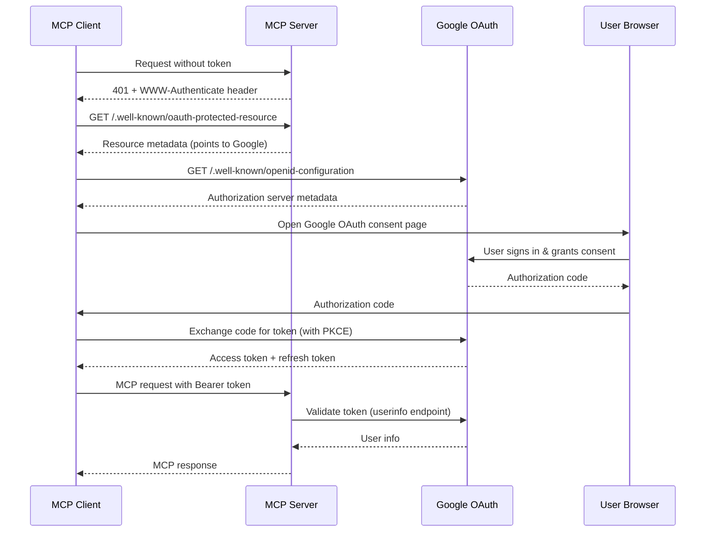

# MCP OAuth 2.1 Authentication with Google

This document describes the OAuth 2.1 authentication implementation for the MCP server according to the Model Context Protocol (MCP) specification dated 2025-06-18.

## Overview

The inboxfewer MCP server implements secure OAuth 2.1 authentication using **Google as the authorization server**. This architecture provides several benefits:

- **Single Sign-On**: Users authenticate with their existing Google accounts
- **Secure by Design**: The LLM never sees OAuth tokens - they're handled entirely by the MCP client
- **Integrated Access**: The same Google credentials grant both access to the MCP server and Google services (Gmail, Drive, Calendar, etc.)
- **Standards Compliant**: Full compliance with OAuth 2.1, PKCE, and RFC 9728 (Protected Resource Metadata)

## Architecture

### Roles

1. **MCP Server** (inboxfewer): Acts as an **OAuth 2.1 Resource Server**
   - Validates Google OAuth tokens
   - Provides Google services (Gmail, Drive, Calendar, etc.)
   - Protected by Bearer token authentication

2. **Google**: Acts as the **OAuth 2.1 Authorization Server**
   - Issues access tokens
   - Handles user authentication and consent
   - Provides token introspection/validation

3. **MCP Client** (Cursor, Claude Desktop, etc.): Acts as the **OAuth 2.1 Client**
   - Discovers the authorization server via Protected Resource Metadata
   - Handles the OAuth flow (opening browser, PKCE, token exchange)
   - Includes Bearer tokens in requests to the MCP server

4. **LLM**: Never sees tokens
   - Only receives responses from MCP tools
   - No access to sensitive authentication credentials

### Security Flow

According to the MCP specification, the authentication flow is:



## Components

### 1. Protected Resource Metadata (RFC 9728)

The MCP server provides an endpoint that tells clients where to find the authorization server:

**Endpoint**: `/.well-known/oauth-protected-resource`

**Response**:
```json
{
  "resource": "https://mcp.example.com",
  "authorization_servers": [
    "https://accounts.google.com"
  ],
  "bearer_methods_supported": [
    "header"
  ],
  "scopes_supported": [
    "https://www.googleapis.com/auth/gmail.readonly",
    "https://www.googleapis.com/auth/gmail.modify",
    "https://www.googleapis.com/auth/drive",
    "https://www.googleapis.com/auth/calendar",
    ...
  ]
}
```

### 2. OAuth Middleware

The middleware (`internal/mcp/oauth/middleware.go`):
- Validates Bearer tokens from the `Authorization` header
- Calls Google's userinfo endpoint to validate tokens and extract user identity
- Stores user identity and token in request context
- Caches Google tokens for accessing Google APIs
- Returns 401 with `WWW-Authenticate` header for invalid/missing tokens

### 3. Token Store & Provider

The token store (`internal/mcp/oauth/store.go`):
- Stores validated Google OAuth tokens in memory
- Associates tokens with user email addresses
- Automatic cleanup of expired tokens (runs every minute)
- No custom token generation - all tokens come from Google

The token provider interface (`internal/google/token_provider.go`):
- Abstracts token retrieval for Google API clients
- File-based provider for STDIO transport (reads from `~/.cache/inboxfewer/`)
- OAuth store provider for HTTP transport (reads from OAuth middleware cache)
- Automatic selection based on transport type

## Authentication for Different Transports

### STDIO Transport (Default)

For STDIO transport (local execution), OAuth is **not used**. Instead, follow the traditional approach:

1. Run the initial setup (if needed) to authenticate with Google
2. Tokens are stored in `~/.cache/inboxfewer/google-{account}.token`
3. The MCP server reads tokens from the filesystem

This follows the MCP specification recommendation: "Implementations using an STDIO transport SHOULD NOT follow this specification, and instead retrieve credentials from the environment."

### HTTP Transport

For HTTP-based transport (remote servers), OAuth authentication is **required**:

1. **Start server with HTTP transport**:
   ```bash
   # Development (localhost) - base URL auto-detected
   inboxfewer serve --transport streamable-http --http-addr :8080
   
   # Production (deployed instance) - MUST specify base URL
   inboxfewer serve --transport streamable-http --http-addr :8080 \
     --base-url "https://inboxfewer.example.com" \
     --google-client-id "your-id.apps.googleusercontent.com" \
     --google-client-secret "your-secret"
   
   # Or use environment variables (recommended for containers/K8s)
   export MCP_BASE_URL="https://inboxfewer.example.com"
   export GOOGLE_CLIENT_ID="your-id.apps.googleusercontent.com"
   export GOOGLE_CLIENT_SECRET="your-secret"
   inboxfewer serve --transport streamable-http --http-addr :8080
   ```
   
   **⚠️ Important:** For deployed instances (Kubernetes, Docker, cloud), you **MUST** set `--base-url` or `MCP_BASE_URL` to the public URL where clients connect. This value is used in the Protected Resource Metadata endpoint (RFC 9728) and must match the URL that MCP clients use to connect.

2. **MCP Client discovers authentication**:
   - Client makes unauthenticated request
   - Server returns `401 Unauthorized` with `WWW-Authenticate` header
   - Client fetches `/.well-known/oauth-protected-resource`
   - Client discovers Google as the authorization server

3. **MCP Client handles OAuth flow**:
   - Client opens browser to Google OAuth consent page
   - User signs in with Google account
   - User grants requested permissions (Gmail, Drive, Calendar, etc.)
   - Client receives authorization code
   - Client exchanges code for access token using PKCE
   - All of this happens **without LLM involvement**

4. **MCP Client makes authenticated requests**:
   ```
   Authorization: Bearer {google_access_token}
   ```

5. **MCP Server validates token**:
   - Calls `https://www.googleapis.com/oauth2/v2/userinfo` with the token
   - Extracts user identity (email, name, etc.)
   - Caches token for accessing Google APIs
   - Processes MCP request

## Required Google OAuth Scopes

The MCP server requests the following Google OAuth scopes:

- `https://www.googleapis.com/auth/gmail.readonly` - Read Gmail messages
- `https://www.googleapis.com/auth/gmail.modify` - Modify Gmail (labels, archive, etc.)
- `https://www.googleapis.com/auth/gmail.send` - Send emails
- `https://www.googleapis.com/auth/gmail.settings.basic` - Manage filters and labels
- `https://www.googleapis.com/auth/documents.readonly` - Read Google Docs
- `https://www.googleapis.com/auth/drive` - Access Google Drive
- `https://www.googleapis.com/auth/calendar` - Manage Google Calendar
- `https://www.googleapis.com/auth/meetings.space.readonly` - Access Google Meet recordings
- `https://www.googleapis.com/auth/tasks` - Manage Google Tasks

## Advanced Features

### Rate Limiting

The MCP server includes built-in rate limiting to protect against abuse:

- **Per-IP Rate Limiting**: Each IP address has its own token bucket
- **Configurable Limits**: Set both rate (requests/second) and burst size
- **Automatic Cleanup**: Inactive rate limiters are removed after 10 minutes
- **Graceful Degradation**: Returns `429 Too Many Requests` with `Retry-After` header

**Configuration**:
```go
RateLimitRate:  10,  // 10 requests per second
RateLimitBurst: 20,  // Allow burst of 20 requests
```

**Rate limit disabled**: Set `RateLimitRate` to `0` to disable rate limiting entirely.

### Token Refresh

The server automatically handles token refresh for long-running sessions:

- **Proactive Refresh**: Tokens are refreshed 5 minutes before expiration
- **Transparent**: Happens automatically during Google API calls
- **Fallback**: If refresh fails, user is prompted to re-authenticate

**How it works**:
1. Google API clients check token expiry before each request
2. If token expires within 5 minutes, refresh is attempted
3. New token is stored in the OAuth store
4. Request proceeds with fresh token

### Token Revocation

Administrators can revoke tokens to force re-authentication:

**Revoke a specific user's token**:
```go
err := oauthHandler.RevokeToken("user@example.com")
```

**Via HTTP endpoint**:
```bash
curl -X POST https://mcp.example.com/oauth/revoke \
  -H "Content-Type: application/json" \
  -d '{"email": "user@example.com"}'
```

**Response**:
```json
{
  "status": "success",
  "message": "Token revoked for user@example.com"
}
```

After revocation, the user must re-authenticate through their MCP client.

### Enhanced Error Messages

The server provides actionable error messages for common issues:

| Error Type | User-Friendly Message |
|------------|----------------------|
| 401 Unauthorized | "Google token is invalid or expired. Please re-authenticate through your MCP client." |
| 403 Forbidden | "Access denied by Google. Please ensure your token has the required scopes." |
| Network errors | "Unable to verify token with Google due to network issues. Please try again." |
| Rate limits | "Google API rate limit exceeded. Please wait a moment and try again." |
| Server errors | "Google authentication service is temporarily unavailable. Please try again later." |

## Security Considerations

### Token Validation

The MCP server validates every Bearer token by:
1. Calling Google's userinfo endpoint: `https://www.googleapis.com/oauth2/v2/userinfo`
2. Verifying the response is successful (HTTP 200)
3. Extracting user identity (email, user ID, name)
4. Automatically refreshing tokens that are close to expiration

Invalid or expired tokens receive a `401 Unauthorized` response with actionable error messages.

### Rate Limiting Protection

Built-in rate limiting protects the server from:
- **Brute force attacks**: Limits authentication attempts per IP
- **Token validation floods**: Prevents excessive validation requests
- **Resource exhaustion**: Protects against DoS attacks

Each IP address gets an independent token bucket with configurable rate and burst limits.

### Token Storage

- **HTTP Transport**: Google tokens are cached in memory (per user session) by the OAuth middleware
- **STDIO Transport**: Tokens are stored in `~/.cache/inboxfewer/google-{account}.token`
- **No token leakage**: Tokens are never written to server logs or exposed to the LLM
- **Client-side**: The MCP client manages token persistence and refresh for HTTP transport
- **Automatic cleanup**: Expired tokens are removed from memory every minute
- **Token provider pattern**: Google API clients automatically use the correct token source based on transport type

### HTTPS Requirement

According to OAuth 2.1 specification:
- **Production**: All OAuth endpoints MUST use HTTPS
- **Development**: Only true loopback addresses (`localhost`, `127.0.0.1`, `::1`) may use HTTP for testing
- **Validation**: Server performs strict URL parsing to prevent bypass attempts (e.g., `localhost.evil.com`)

### PKCE (Proof Key for Code Exchange)

The MCP client MUST use PKCE when exchanging authorization codes for tokens. This prevents authorization code interception attacks.

## Multi-Account Support

The MCP server supports multiple Google accounts:

```javascript
// Use specific account in MCP tool call
{
  "tool": "gmail_list_threads",
  "arguments": {
    "account": "work",
    "query": "in:inbox"
  }
}
```

Each account has its own cached Google token, identified by the account name (email address).

## Configuration

### OAuth Handler Configuration

**⚠️ CRITICAL for Deployed Instances:** The `Resource` field MUST match the public URL where clients connect. For deployed instances, use the `--base-url` flag or `MCP_BASE_URL` environment variable.

```go
config := &oauth.Config{
    Resource: "https://mcp.example.com",  // MCP server URL (MUST match public URL!)
    
    SupportedScopes: []string{
        "https://www.googleapis.com/auth/gmail.readonly",
        "https://www.googleapis.com/auth/gmail.modify",
        "https://www.googleapis.com/auth/drive",
        // ... other Google scopes
    },
    
    // Google OAuth Credentials (OPTIONAL - enables automatic token refresh)
    // If not provided, tokens will not be automatically refreshed, and users
    // will need to re-authenticate when their tokens expire.
    // 
    // To enable token refresh:
    // 1. Create a Google Cloud Project at https://console.cloud.google.com
    // 2. Enable the APIs you need (Gmail, Drive, Calendar, etc.)
    // 3. Create OAuth 2.0 credentials (Web application type)
    // 4. Add authorized redirect URIs (your MCP server endpoints)
    // 5. Use the Client ID and Client Secret here
    GoogleClientID:     "your-client-id.apps.googleusercontent.com",
    GoogleClientSecret: "your-client-secret",
    
    // Rate Limiting (protects against abuse)
    RateLimitRate:              10,             // 10 requests per second per IP
    RateLimitBurst:             20,             // Allow burst of 20 requests
    RateLimitCleanupInterval:   5 * time.Minute, // Cleanup inactive rate limiters
    
    // Security
    TrustProxy:      false,          // Only trust proxy headers if behind trusted proxy (secure by default)
    
    // Token Management
    CleanupInterval: 1 * time.Minute, // Cleanup expired tokens every minute
    
    // Logging (optional)
    Logger: slog.Default(),          // Structured logging
}

handler, err := oauth.NewHandler(config)

// Check if token refresh is enabled
if handler.CanRefreshTokens() {
    log.Info("Token refresh is enabled - tokens will be automatically refreshed before expiration")
} else {
    log.Warn("Token refresh is disabled - users will need to re-authenticate when tokens expire")
}
```

### Token Refresh Requirements

**Automatic token refresh is OPTIONAL but recommended for production deployments.**

#### Without Token Refresh (Default)
- Users authenticate via their MCP client
- Tokens are cached but NOT refreshed
- When tokens expire (typically after 1 hour), users must re-authenticate
- Suitable for: development, testing, short sessions

#### With Token Refresh (Recommended for Production)
- **Requires:** `GoogleClientID` and `GoogleClientSecret` configuration
- Tokens are automatically refreshed 5 minutes before expiration
- Seamless user experience with no interruptions
- Users only re-authenticate if refresh token expires or is revoked
- Suitable for: production deployments, long-running sessions

#### How to Enable Token Refresh

1. **Create Google Cloud Project:**
   - Visit https://console.cloud.google.com
   - Create a new project or select existing one

2. **Enable APIs:**
   - Navigate to "APIs & Services" > "Library"
   - Enable: Gmail API, Drive API, Calendar API, etc.

3. **Create OAuth 2.0 Credentials:**
   - Go to "APIs & Services" > "Credentials"
   - Click "Create Credentials" > "OAuth 2.0 Client ID"
   - Application type: "Web application"
   - Add authorized redirect URIs (your MCP server endpoints)
   - Note the Client ID and Client Secret

4. **Configure Handler:**
   ```go
   config := &oauth.Config{
       Resource:           "https://mcp.example.com",
       GoogleClientID:     "YOUR_CLIENT_ID.apps.googleusercontent.com",
       GoogleClientSecret: "YOUR_CLIENT_SECRET",
       // ... other config
   }
   ```

5. **Verify:**
   ```go
   handler, _ := oauth.NewHandler(config)
   if !handler.CanRefreshTokens() {
       log.Fatal("Token refresh not enabled - check credentials")
   }
   ```

#### Token Refresh Behavior

- **Automatic:** Middleware checks token expiry on every request
- **Proactive:** Refreshes tokens 5 minutes before they expire
- **Transparent:** Users never see "token expired" errors
- **Fallback:** If refresh fails, returns 401 with actionable error message
- **Logging:** All refresh attempts are logged for debugging

### Integration with HTTP Server

```go
// Create OAuth-enabled HTTP server
oauthServer, err := server.NewOAuthHTTPServer(mcpServer, "streamable-http", baseURL)
if err != nil {
    log.Fatal(err)
}

// Start server
if err := oauthServer.Start(":8080"); err != nil {
    log.Fatal(err)
}
```

The server automatically:
- Serves Protected Resource Metadata at `/.well-known/oauth-protected-resource`
- Wraps MCP endpoints with OAuth middleware
- Returns appropriate `WWW-Authenticate` headers

## Testing

Run tests with:

```bash
make test
```

The OAuth implementation includes tests for:
- Protected Resource Metadata generation
- Token validation (with mocked Google responses)
- Middleware behavior (missing tokens, invalid tokens, etc.)
- Token store operations

## Troubleshooting

### "Missing Authorization header"

**Cause**: MCP client is not sending Bearer token

**Solution**: Ensure your MCP client supports OAuth 2.1 and properly discovers the authorization server via Protected Resource Metadata

### "Token validation failed"

**Cause**: Invalid or expired Google OAuth token

**Solution**: The MCP client should automatically refresh the token. If it doesn't, re-authenticate through the client.

### "Please authenticate with Google through your MCP client"

**Cause**: No cached Google token for the requested account

**Solution**: 
- For HTTP: The MCP client will automatically initiate OAuth flow
- For STDIO: Run authentication setup or check token files in `~/.cache/inboxfewer/`

## Migrating from Old Authentication

The previous insecure authentication flow (where users pasted auth codes into the LLM) has been **removed** for security reasons.

**Old flow** (insecure, removed):
1. LLM calls `google_get_auth_url` tool → gets URL
2. User visits URL, gets auth code
3. User pastes code back to LLM
4. LLM calls `google_save_auth_code` tool → stores token
5. **Problem**: LLM sees the auth code!

**New flow** (secure):
1. MCP client detects missing authentication
2. Client opens browser with Google OAuth
3. User authenticates with Google
4. Client receives and stores token
5. Client includes token in requests to MCP server
6. **LLM never sees any tokens!**

## 🎉 Recent Improvements

### OAuth Token Provider Integration Fix (Latest)

**Critical fix**: Resolved OAuth token provider integration gap:

1. **Fixed Token Flow**: 
   - OAuth middleware now properly connects to Google API clients
   - HTTP transport creates OAuth handler first
   - ServerContext recreated with OAuth token provider
   - Eliminates "no valid token" errors after successful authentication

2. **CLI Enhancements**:
   - Added `--google-client-id` and `--google-client-secret` flags
   - Support for `GOOGLE_CLIENT_ID` and `GOOGLE_CLIENT_SECRET` env vars
   - Clear visual feedback for token refresh status on startup

3. **User Experience**:
   - Server displays token refresh capability on startup
   - Helpful messages guide users to enable automatic refresh
   - Seamless integration between OAuth authentication and Google API access

### Cleanup and Simplification

The OAuth implementation has been significantly cleaned up:

1. **Removed Obsolete Code**: 
   - Removed PKCE implementation (Google handles authorization)
   - Removed unused OAuth types (ClientInfo, AuthorizationCode, etc.)
   - Simplified Store to only manage Google tokens

2. **Token Refresh**:
   - Added `GoogleClientID` and `GoogleClientSecret` to Config
   - Automatic token refresh now fully functional when credentials provided
   - Middleware proactively refreshes tokens 5 minutes before expiration

3. **Dependency Injection**:
   - Removed global `TokenProvider` state
   - All Google API clients now accept `TokenProvider` via constructor
   - ServerContext properly injects token provider to clients

4. **Structured Logging**:
   - Replaced all `fmt.Printf` with `log/slog` structured logging
   - Better debugging and production logging
   - Configurable logger in Config

5. **Configurable Options**:
   - `RateLimitCleanupInterval` now configurable
   - `TrustProxy` defaults to false (secure by default)
   - Clear documentation for all config options

6. **Test Coverage**:
   - All tests updated and passing
   - Removed tests for obsolete functionality
   - Maintained 75.2% coverage for OAuth package

### Code Quality Improvements

- **KISS Principle**: Removed complexity by eliminating custom OAuth authorization server
- **Clean Architecture**: Proper dependency injection instead of global state
- **Least Surprise**: Clear, predictable behavior throughout
- **Production Ready**: Enterprise-grade logging and configuration

## References

- [MCP Specification - Authorization](https://modelcontextprotocol.io/specification/2025-06-18/basic/authorization)
- [OAuth 2.1](https://datatracker.ietf.org/doc/html/draft-ietf-oauth-v2-1-13)
- [RFC 9728 - OAuth 2.0 Protected Resource Metadata](https://datatracker.ietf.org/doc/html/rfc9728)
- [RFC 8707 - Resource Indicators for OAuth 2.0](https://datatracker.ietf.org/doc/html/rfc8707)
- [RFC 7636 - Proof Key for Code Exchange (PKCE)](https://datatracker.ietf.org/doc/html/rfc7636)
- [Google OAuth 2.0](https://developers.google.com/identity/protocols/oauth2)
